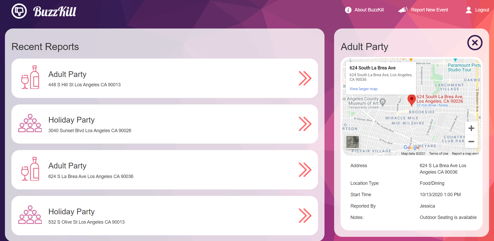
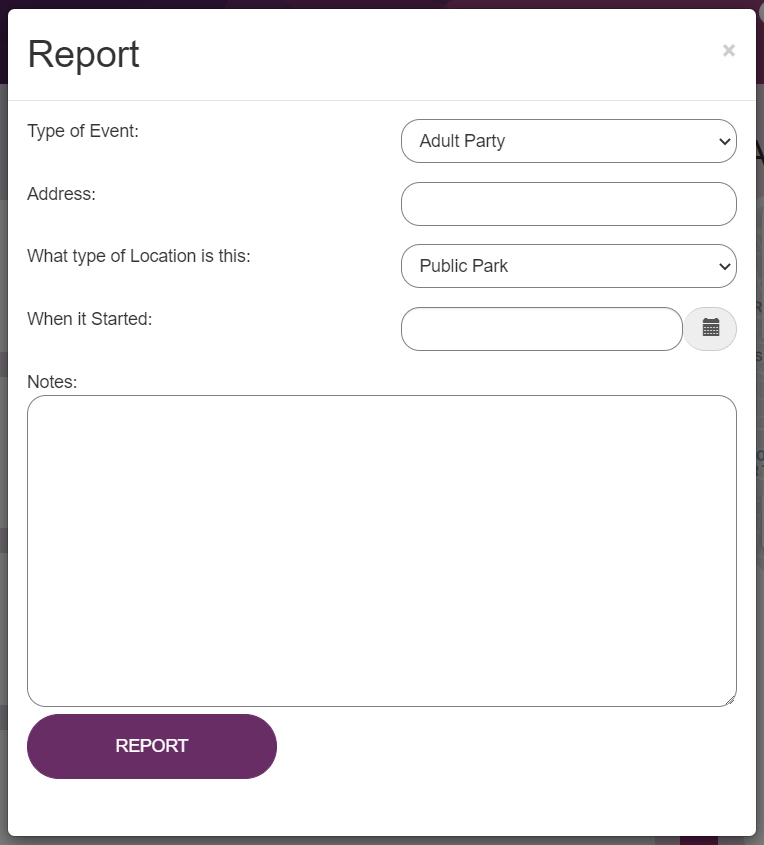

# BuzzKill

An application that utilizes user-based reporting and Google Maps to review public locations. 
Visit the site here: [Buzzkill](https://salty-hollows-77148.herokuapp.com/)  

## Table of Contents

[Description](#Description) 
[Usage](#Usage) 
[Contributors](#Contributors) 
[Links](#Links)

## Description:
An applications which takes Covid-19, user based reporting and Google maps to record any violations that might be occuring within a neighborhood. Users can make and view recent reports of any social distancing or other violations regarding Covid-19.

## Usage:
Upon entering the main site, users can see a list of reports that have been made in a report that shows a map and user-made description.  

Registered users can make a new report which will appear in the list of displayed reports by clicking the "Report New Event" button and filling out the form.

## Contributors:
Contributors and github usernames 
Alex Blake: alexblakela 
Michael Moreno: mgmoreno22 
Usman Chaudry:  usmanjchaudry 
Teresa Maldonado: teresam3

## Links
Deployed Heroku: https://salty-hollows-77148.herokuapp.com/ 
GitHub repo: https://github.com/mgmoreno22/BuzzKill
